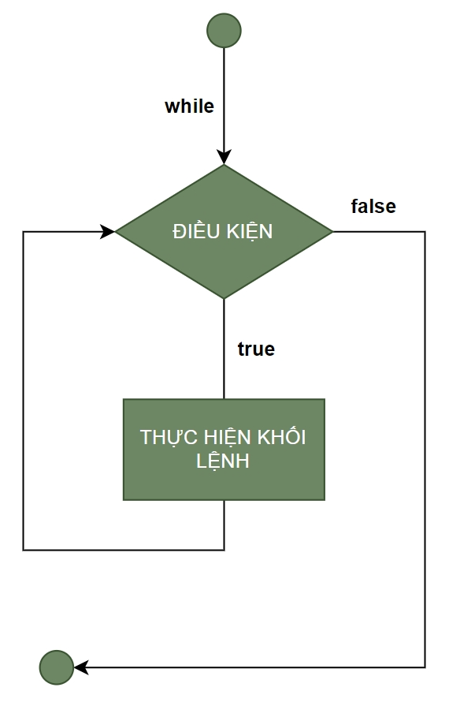
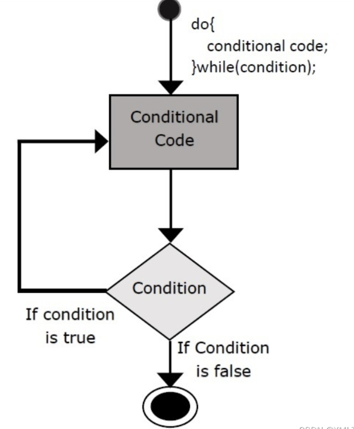

# **Cấu trúc vòng lặp (Loops) trong C**

Trong lập trình C, vòng lặp giúp thực hiện lặp lại một khối lệnh nhiều lần mà không cần phải viết lại cùng một đoạn mã. Các vòng lặp không chỉ giúp **giảm thiểu sự lặp lại** của mã nguồn mà còn làm cho chương trình trở nên **ngắn gọn**, **rõ ràng** và **dễ bảo trì**. Hai loại vòng lặp phổ biến nhất trong C là:

- **Vòng lặp `for`** – Thích hợp khi **biết trước số lần lặp**.
- **Vòng lặp `while`** – Thích hợp khi **số lần lặp không xác định trước** và phụ thuộc vào một điều kiện.

---

# **1. Vòng lặp `for` trong C**

## **Cú pháp cơ bản**

```c
for (giá_trị_khởi_tạo; điều_kiện_dừng; bước_nhảy) {
    // Khối lệnh sẽ thực thi nếu điều kiện đúng
}
```

- **`giá_trị_khởi_tạo`**: Thực hiện một lần duy nhất khi bắt đầu vòng lặp.
- **`điều_kiện_dừng`**: Được kiểm tra trước mỗi lần lặp; nếu đúng thì thực thi khối lệnh, nếu sai thì vòng lặp kết thúc.
- **`bước_nhảy`**: Cập nhật giá trị biến điều khiển sau mỗi lần lặp.

> **Lưu ý:** Trong C (tiêu chuẩn C89/C90), không thể khai báo biến `int i` trực tiếp trong phần khởi tạo của vòng lặp `for`. Biến phải được khai báo bên ngoài vòng lặp. Hỗ trợ khai báo biến trong `for` chỉ có từ C99 trở lên hoặc trong C++. Nên trong bài viết này, chúng ta sẽ sử dụng cách khai báo biến bên ngoài vòng lặp.

## **Lưu đồ**

<p align="center" style="background-color: white">
    
</p>

## **Ví dụ minh họa**

In ra các số từ 1 đến 5:

```c
for (int i = 1; i <= 5; i++) {
    printf("%d\n", i);
}

// Hoặc:

int i;
for (i = 1; i <= 5; i++) {
    printf("%d\n", i);
}
```

## **Các trường hợp đặc biệt của vòng lặp `for`**

## **Vòng lặp vô hạn với `for`**

```c
for (;;) {
    // Tương đương với while(1)
    // Thực thi mãi mãi cho đến khi gặp break hoặc return
}
```

## **Vòng lặp không có phần thân**

```c
for (int i = 0; i < n; i++); // Chú ý dấu chấm phẩy ở cuối
```

Đây là một vòng lặp hợp lệ nhưng không có tác dụng thực tế vì không có câu lệnh nào được thực thi trong vòng lặp.

## **Vòng lặp `for` lồng nhau**

Vòng lặp `for` có thể được lồng vào nhau để xử lý các cấu trúc phức tạp, ví dụ như xử lý ma trận hay in bảng cửu chương.

**Ví dụ: In bảng cửu chương từ 2 đến 5**

```c
for (int i = 2; i <= 5; i++) {
    for (int j = 1; j <= 10; j++) {
        printf("%d x %d = %d\n", i, j, i * j);
    }
    printf("\n");
}

// Hoặc:
int i, j;
for (i = 2; i <= 5; i++) {
    for (j = 1; j <= 10; j++) {
        printf("%d x %d = %d\n", i, j, i * j);
    }
    printf("\n");
}
```

## **Bỏ qua một phần của vòng lặp**

Bạn có thể bỏ qua `khởi_tạo`, `điều_kiện` hoặc `bước_nhảy` nhưng phải giữ lại ít nhất một dấu `;`.

Ví dụ: Bỏ qua phần `bước_nhảy` và cập nhật bên trong thân vòng lặp:

```c
int i;
for (i = 0; i < 5; ) {
    printf("%d\n", i);
    i++;  // Cập nhật biến bên ngoài phần khai báo vòng lặp
}
```

---

# **2. Vòng lặp `while` trong C**

Vòng lặp `while` thường dùng khi số lần lặp không được xác định trước và phụ thuộc vào điều kiện.

## **Cú pháp**

```c
while (điều_kiện) {
    // Khối lệnh sẽ thực thi nếu điều kiện đúng
}
```

## **Lưu đồ**

<p align="center" style="background-color: white">
    
</p>

## **Ví dụ minh họa**

In ra các số từ 1 đến 5:

```c
int i = 1;
while (i <= 5) {
    printf("%d\n", i);
    i++;  // Cần đảm bảo cập nhật điều kiện để tránh vòng lặp vô hạn
}
```

## **Vòng lặp vô hạn**

Nếu điều kiện luôn đúng, vòng lặp sẽ chạy mãi mãi:

```c
while (1) {
    // Hoặc while (true) trong C++
    printf("Vòng lặp vô hạn\n");
    // Cần có cơ chế dừng vòng lặp, ví dụ như sử dụng 'break'
}
```

---

# **3. Vòng lặp `do-while` trong C**

Vòng lặp `do-while` luôn đảm bảo thực hiện ít nhất một lần, vì điều kiện được kiểm tra sau khi khối lệnh được thực thi.

## **Cú pháp**

```c
do {
    // Khối lệnh thực thi ít nhất một lần
} while (điều_kiện);
```

## **Lưu đồ**

<p align="center" style="background-color: white">
    
</p>

## **Ví dụ minh họa**

In ra các số từ 1 đến 5:

```c
int i = 1;
do {
    printf("%d\n", i);
    i++;
} while (i <= 5);
```

---

# **4. Câu lệnh điều khiển vòng lặp**

Để điều khiển quá trình lặp, C cung cấp các câu lệnh sau:

## **`break` – Dừng vòng lặp**

Khi điều kiện nhất định được thỏa mãn, câu lệnh `break` sẽ thoát khỏi vòng lặp ngay lập tức.

```c
for (int i = 1; i <= 10; i++) {
    if (i == 5) break;  // Khi i = 5, vòng lặp kết thúc
    printf("%d\n", i);
}
```

## **`continue` – Bỏ qua lần lặp hiện tại**

Khi gặp `continue`, chương trình sẽ bỏ qua toàn bộ phần chương trình còn lại của vòng lặp hiện tại và chuyển sang lần lặp tiếp theo. Điều này hữu ích khi bạn muốn bỏ qua một số điều kiện nhất định trong vòng lặp.

```c
for (int i = 1; i <= 5; i++) {
    if (i == 3) continue;  // Khi i = 3, bỏ qua lần lặp đó
    printf("%d\n", i);
}
```

---

# **5. Khi nào sử dụng `for` và `while`?**

| Trường hợp                       | `for` | `while` |
| -------------------------------- | ----- | ------- |
| Biết trước số lần lặp            | ✅    | ❌      |
| Không biết trước số lần lặp      | ❌    | ✅      |
| Dễ đọc khi có điều kiện đơn giản | ✅    | ✅      |
| Dễ quên cập nhật biến điều kiện  | ❌    | ✅      |

**Ví dụ cụ thể:**

- **Duyệt mảng, lặp theo chỉ số → `for`**  
  (Vì số lượng phần tử đã biết trước.)
- **Chờ sự kiện hoặc nhập dữ liệu từ người dùng → `while`**  
  (Vì số lần lặp phụ thuộc vào điều kiện xảy ra hay không.)

---

# **6. Lưu ý khi sử dụng vòng lặp**

- **Đảm bảo điều kiện dừng:** Luôn cập nhật biến điều kiện để tránh trường hợp vòng lặp vô hạn.
- **Hiểu rõ phạm vi biến:** Khi khai báo biến trong vòng lặp (ví dụ: `for (int i = 0; ...)`), lưu ý rằng phạm vi của biến chỉ tồn tại trong khối lệnh của vòng lặp.
- **Tránh phức tạp hóa:** Sử dụng vòng lặp lồng nhau quá sâu có thể gây khó khăn trong việc theo dõi và gỡ lỗi.
- **Hiệu năng:** Trong một số trường hợp, việc tối ưu hóa vòng lặp (ví dụ: unrolling, tức là mở rộng vòng lặp) có thể cải thiện hiệu năng, đặc biệt với số lần lặp lớn. Tuy nhiên, cần cân nhắc kỹ lưỡng vì nó có thể làm tăng kích thước mã nguồn và làm giảm tính dễ đọc của mã.

---

# **Tổng kết**

- **`for`**: Lý tưởng khi biết trước số lần lặp, cấu trúc rõ ràng và phù hợp cho việc duyệt mảng hay các phép tính lặp đơn giản.
- **`while`**: Phù hợp với các tình huống mà số lần lặp phụ thuộc vào điều kiện được kiểm tra trong quá trình thực thi.
- **`do-while`**: Đảm bảo khối lệnh luôn được thực thi ít nhất một lần, hữu ích khi cần thực hiện thao tác trước khi kiểm tra điều kiện.
- **Câu lệnh `break` và `continue`**: Cung cấp sự linh hoạt trong việc kiểm soát luồng chương trình bên trong vòng lặp.
- **Lưu ý khi sử dụng vòng lặp**: Luôn đảm bảo điều kiện dừng hợp lý và quản lý phạm vi biến một cách chính xác để tránh lỗi và tối ưu hiệu năng.
